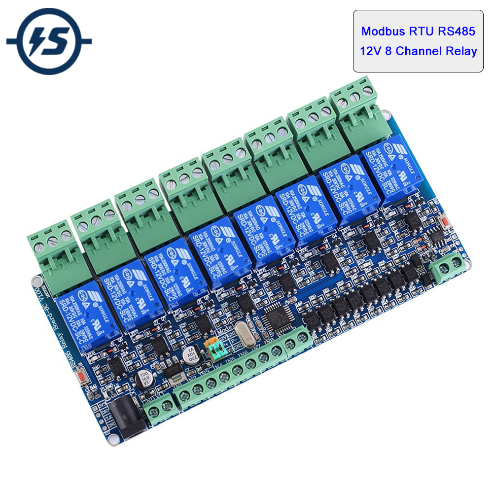

# [Modbus RTU 8 Channel Relay Switch](https://aliexpress.ru/item/4001171723396.html)



## Simple CLI

Simple command line tool src/rtu.py based on [umodbus](https://umodbus.readthedocs.io/) module:

```bash 
$ ./src/rtu.py 
[sudo] password for matsi: 
usage: rtu.py [-h] [-d DEVICE] [-s SERVER] {scan,pins,relay,relays} ...

positional arguments:
  {scan,pins,relay,relays}
                        commands
    scan                scan modbus rtu device address
    pins                read input pins
    relay               relay commands
    relays              multi-relays commands

options:
  -h, --help            show this help message and exit
  -d DEVICE, --device DEVICE
                        serial device for modbus connection
  -s SERVER, --server SERVER
                        modbus rtu server address
```

Basic input pin functions:

```bash
$ ./src/rtu.py pins -h
usage: rtu.py pins [-h] [-p {0,1,2,3,4,5,6,7}]

options:
  -h, --help            show this help message and exit
  -p {0,1,2,3,4,5,6,7}, --pin {0,1,2,3,4,5,6,7}
                        select input pin

$ ./src/rtu.py pins
[0, 0, 0, 0, 0, 1, 0, 0]

$ ./src/rtu.py pins --pin 6
0
```

Basic relay functions:

```bash
$ ./src/rtu.py relay -h
usage: rtu.py relay [-h] {on,off,flip,read} ...

positional arguments:
  {on,off,flip,read}  commands
    on                turn on relay
    off               turn off relay
    flip              flip relay state
    read              read relay state

options:
  -h, --help          show this help message and exit

$ ./src/rtu.py relay on 7

$ ./src/rtu.py relay read 7
1

$ ./src/rtu.py relay flip 7

$ ./src/rtu.py relay read 7
0
```

## Modbus-RTU control using modbus-cli

Project: https://github.com/favalex/modbus-cli

### Install modbus-cli

```bash
$ pip install modbus_cli
```

### Get device address

Read address:

```bash
$ sudo modbus -b 9600 -P n -p 1 -v /dev/ttyUSB0 -s 0 h@0
Parsed 0 registers definitions from 1 files
Serial port /dev/ttyUSB0. Parameters: 9600 baud, 1 stop bit(s), parity: N, timeout 5.0s.
→ < 00 03 00 00 00 01 85 db >
← < 00 03 02 00 01 44 44 > 7 bytes
← [1]
0: 1 0x1
```

### One command to read all input pins

Read input pins:
```bash
$ sudo modbus -b 9600 -P n -p 1 -v /dev/ttyUSB0 -s 1 d@0/d
```

Example:
```bash
$ sudo modbus -b 9600 -P n -p 1 /dev/ttyUSB0 -s 1 -v d@0/d
Parsed 0 registers definitions from 1 files
Serial port /dev/ttyUSB0. Parameters: 9600 baud, 1 stop bit(s), parity: N, timeout 5.0s.
→ < 01 02 00 00 00 08 79 cc >
← < 01 02 01 20 a0 50 > 6 bytes
← [0, 0, 0, 0, 0, 1, 0, 0]
0: 0 0x0
```

### Read relays status

Read relay X status (X=0..7):
```bash
$ sudo modbus -b 9600 -P n -p 1 -v /dev/ttyUSB0 -s 1 c@X
```

Examples:
```bash
$ sudo modbus -b 9600 -P n -p 1 -v /dev/ttyUSB0 -s 1 c@0
Parsed 0 registers definitions from 1 files
Serial port /dev/ttyUSB0. Parameters: 9600 baud, 1 stop bit(s), parity: N, timeout 5.0s.
→ < 01 01 00 00 00 01 fd ca >
← < 01 01 01 00 51 88 > 6 bytes
← [0]
0: 0 0x0

$ sudo modbus -b 9600 -P n -p 1 -v /dev/ttyUSB0 -s 1 c@5
Parsed 0 registers definitions from 1 files
Serial port /dev/ttyUSB0. Parameters: 9600 baud, 1 stop bit(s), parity: N, timeout 5.0s.
→ < 01 01 00 05 00 01 ed cb >
← < 01 01 01 00 51 88 > 6 bytes
← [0]
5: 0 0x0
```

### Read all relays

Read all relays status:

```bash
$ sudo modbus -b 9600 -P n -p 1 -v /dev/ttyUSB0 -s 1 c@0/d
```

Example:

```bash
$ sudo modbus -b 9600 -P n -p 1 -v /dev/ttyUSB0 -s 1 c@0/d
Parsed 0 registers definitions from 1 files
Serial port /dev/ttyUSB0. Parameters: 9600 baud, 1 stop bit(s), parity: N, timeout 5.0s.
→ < 01 01 00 00 00 08 3d cc >
← < 01 01 01 60 51 a0 > 6 bytes
← [0, 0, 0, 0, 0, 1, 1, 0]
0: 0 0x0
```

### Turn relay on/off

Turn on relay X(X=0..7):
```bash
$ sudo modbus -b 9600 -P n -p 1 -v /dev/ttyUSB0 -s 1 c@X=65280
```

Turn off relay X(X=0..7):
```bash
$ sudo modbus -b 9600 -P n -p 1 -v /dev/ttyUSB0 -s 1 c@X=0
```

Examples:
```bash
# relay 5: turn on
$ sudo modbus -b 9600 -P n -p 1 -v /dev/ttyUSB0 -s 1 c@5=65280
Parsed 0 registers definitions from 1 files
Serial port /dev/ttyUSB0. Parameters: 9600 baud, 1 stop bit(s), parity: N, timeout 5.0s.
→ < 01 05 00 05 ff 00 9c 3b >
← < 01 05 00 05 ff 00 9c 3b > 8 bytes

# relay 5: read status
$ sudo modbus -b 9600 -P n -p 1 -v /dev/ttyUSB0 -s 1 c@5      
Parsed 0 registers definitions from 1 files
Serial port /dev/ttyUSB0. Parameters: 9600 baud, 1 stop bit(s), parity: N, timeout 5.0s.
→ < 01 01 00 05 00 01 ed cb >
← < 01 01 01 01 90 48 > 6 bytes
← [1]
5: 1 0x1

# relay 5: turn off
$ sudo modbus -b 9600 -P n -p 1 -v /dev/ttyUSB0 -s 1 c@5=0    
Parsed 0 registers definitions from 1 files
Serial port /dev/ttyUSB0. Parameters: 9600 baud, 1 stop bit(s), parity: N, timeout 5.0s.
→ < 01 05 00 05 00 00 dd cb >
← < 01 05 00 05 00 00 dd cb > 8 bytes

# relay 5: read status
$ sudo modbus -b 9600 -P n -p 1 -v /dev/ttyUSB0 -s 1 c@5  
Parsed 0 registers definitions from 1 files
Serial port /dev/ttyUSB0. Parameters: 9600 baud, 1 stop bit(s), parity: N, timeout 5.0s.
→ < 01 01 00 05 00 01 ed cb >
← < 01 01 01 00 51 88 > 6 bytes
← [0]
5: 0 0x0
```
