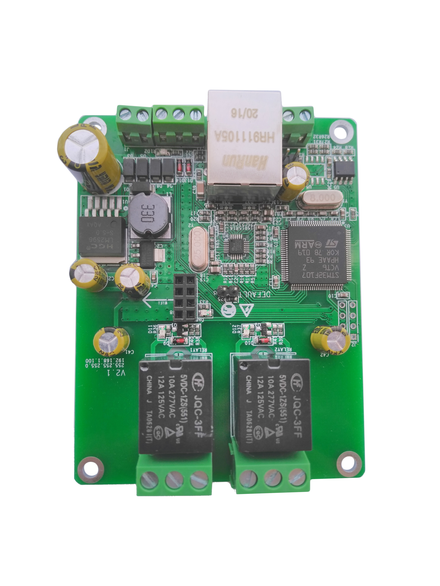

# [Dingtian 2-channel Relay Board](https://www.dingtian-tech.com/en_us/relay2.html)



## Simple CLI

TODO

## Using modbus-cli

Project: https://github.com/favalex/modbus-cli

### Install modbus-cli

```bash
$ pip install modbus_cli
```

### TODO

TODO
